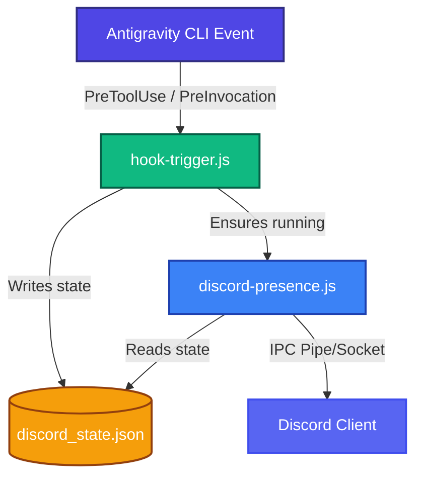

# Antigravity CLI Discord Rich Presence 🚀

[](https://opensource.org/licenses/MIT)
[](https://nodejs.org/)
[](#)
[](#)

A lightweight, dependency-free Node.js integration to display your active **Google Antigravity CLI** coding status as Discord Rich Presence. It updates your status in real-time, showing when you are thinking, running terminal commands, editing files, or idling.

```text
       Playing Antigravity CLI
       Thinking: Analyzing task and planning...
       Project: MyAwesomeProject
       01:23 elapsed
```

---

## ✨ Features
- **Zero Dependencies**: Connects directly to Discord's Local Named Pipes (Windows) or Unix Sockets (macOS/Linux) using Node's native `net` module. Extremely lightweight.
- **Cross-Platform**: Automatically resolves paths for Windows named pipes and Unix domain sockets.
- **Dynamic File Icon Resolution**: Displays file-specific icons dynamically using [Material Icon Theme](https://github.com/PKief/vscode-material-icon-theme) matching the file you are currently viewing or editing.
- **Real-Time Hook Execution**: Intercepts TUI lifecycle events (`PreToolUse`, `PostToolUse`, `PreInvocation`, etc.) to update status instantly.
- **Automatic Lifecycle Control**: Starts up and terminates automatically alongside the CLI as an Antigravity Sidecar process.

---

## 🛠️ Installation & Setup

To install this globally for all your Antigravity workspaces:

### Option A: Direct Installation from GitHub (Cross-Platform) - **Recommended**
You don't even need to clone this repository! Simply install it globally from the GitHub archive tarball URL:

On **macOS/Linux**:
```bash
npm install -g https://github.com/itznan/agy-discord-presence/archive/refs/heads/main.tar.gz
```

On **Windows (PowerShell)**:
```powershell
npm.cmd install -g https://github.com/itznan/agy-discord-presence/archive/refs/heads/main.tar.gz
```
NPM will automatically download and unpack the release directly, triggering the automated configuration and installation of all sidecar and hook files.

### Option B: Local Clone Installation
If you have cloned this repository locally, you can run:
```bash
npm install
```
This triggers the postinstall configuration script locally and copies the sidecar files.

### Option C: Manual Installation (Cross-Platform)
If you prefer not to use `npm install`, you can manually:
1. Copy `sidecar.json` and the `dist/` directory to your global Antigravity config directory under the `sidecars` namespace:
   - **Path**: `~/.gemini/config/sidecars/discord_presence/`
     *(e.g., `C:\Users\<YourUsername>\.gemini\config\sidecars\discord_presence\` on Windows or `~/.gemini/config/sidecars/discord_presence/` on macOS/Linux)*
2. Copy the hook definitions from `hooks.json` in this repository into your global `hooks.json` file located at `~/.gemini/config/hooks.json` (under the `"discord-presence"` key).

---

## 🔍 How It Works (Architecture)

The integration consists of two main components:
1. **The Hook Trigger (`hook-trigger.js`)**: Runs quickly on every lifecycle event of the Antigravity TUI. It serializes the event details, active files, and tool invocation arguments to `discord_state.json`, then triggers the daemon if it's not already running.
2. **The Sidecar Daemon (`discord-presence.js`)**: A persistent background process that maintains the IPC connection with Discord, throttles status updates, checks if the main TUI process is still alive, and shuts itself down cleanly when the TUI exits.



---

## 🎨 Dynamic File Icons

When editing or viewing files, the Discord status dynamically updates its large icon based on the file type. We map a wide range of extensions and special filenames to Material Icon Theme graphics:

| Category | Supported Languages / Types |
| :--- | :--- |
| **Web / JS** | JS, MJS, JSX, TS, TSX, Vue, Svelte, HTML, CSS, SCSS, Sass, Less |
| **Languages** | Python (`.py`, `.ipynb`), C, C++, C#, Java, Kotlin, Scala, Go, Rust, Swift, Dart, PHP, Ruby, Perl |
| **Scripts** | Shell (`.sh`, `.bash`), PowerShell (`.ps1`), Batch (`.bat`, `.cmd`) |
| **Data & Config**| JSON, YAML, XML, TOML, INI, SQL, DB |
| **Special Files** | `Dockerfile`, `package.json`, `tsconfig.json`, `webpack.config.js`, `vite.config.js`, `next.config.js`, `.gitignore`, `hooks.json`, `sidecar.json`, `README.md` |

---

## ⚙️ Customizing Discord Branding (Client ID & Icons)

By default, the integration uses a generic Application ID displaying "Antigravity CLI". To show your own customized branding, name, or icons:

1. Head to the [Discord Developer Portal](https://discord.com/developers/applications).
2. Click **New Application** and name it (e.g., `Antigravity CLI`, or `Gemini Coding`). The name of the application will display on Discord as: `Playing <Application Name>`.
3. Select **Rich Presence** -> **Visual Assets** in the sidebar. Upload the following images:
   - A large image named `antigravity` (your logo)
   - A small active status indicator named `active`
   - A small idle status indicator named `idle`
4. Copy the **Application ID** (Client ID) from the **General Information** page.
5. Provide this ID either by:
   - Setting the `DISCORD_CLIENT_ID` environment variable:
     ```bash
     export DISCORD_CLIENT_ID="your_client_id_here"
     ```
   - Or replacing `DEFAULT_CLIENT_ID` directly inside `src/discord-presence.js`.

---

## 🔧 Uninstallation & Disabling

### Option A: Global Uninstallation (Cross-Platform) - **Recommended**
If you installed it globally via GitHub, execute the global cleanup command and then uninstall:

On **macOS/Linux**:
```bash
discord-presence-uninstall
npm uninstall -g agy-discord-presence
```

On **Windows (PowerShell)**:
```powershell
discord-presence-uninstall.cmd
npm.cmd uninstall -g agy-discord-presence
```
The first command cleanly stops any running background processes and cleans up your configuration directory. The second command removes the package from your global node modules.

### Option B: Local Clone Uninstallation
If you are using a cloned repository, you can run:
```bash
npm run uninstall
```

### Option C: Manual Uninstallation (Cross-Platform)
If you prefer manual cleanup, you can:
1. Delete the sidecar directory:
   - **Path**: `~/.gemini/config/sidecars/discord_presence/`
2. Remove the `"discord-presence"` block from your global `~/.gemini/config/hooks.json` file.

### Temporarily Disabling
To temporarily turn off the Discord updates without uninstalling:
- Type `/hooks` inside the Antigravity TUI to view, enable, or disable active hooks dynamically.
- Or temporarily rename or remove the `~/.gemini/config/hooks.json` file.

## 🛠️ Development & Bundling

If you make modifications to the source code under the `src/` directory, you need to rebuild the minified files under the `dist/` directory before installing.

To build/minify the files:
```bash
npm run build
```
This uses `esbuild` to compile all source JS files and bundle them into compact, single-file scripts in `dist/`.

## 📄 License
This project is open-source and licensed under the [MIT License](https://opensource.org/licenses/MIT).

